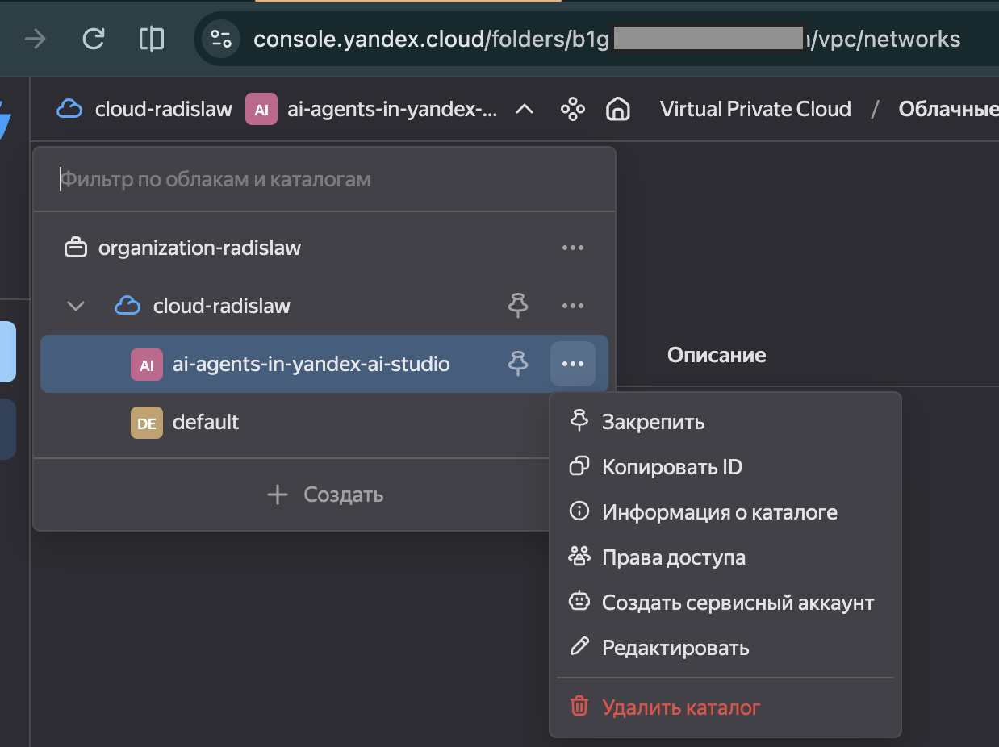

# Как получить folder_id и api_key для Yandex AI Studio

Источники: официальная документация Yandex AI Studio —
[Быстрый старт](https://aistudio.yandex.ru/docs/ru/ai-studio/quickstart/) и
[Как создать API-ключ](https://aistudio.yandex.ru/docs/ru/ai-studio/operations/get-api-key.html).

## 1. Войти в AI Studio

Перейти на [aistudio.yandex.cloud/platform](https://aistudio.yandex.cloud/platform/) и авторизоваться через Яндекс ID.

Перед созданием ключа нужен привязанный платёжный аккаунт (карта) со статусом `ACTIVE` или `TRIAL_ACTIVE` — без этого кнопка создания ключа не сработает.

## 2. Скопировать `folder_id`

В верхней части экрана нужно навести курсор на название каталога — рядом появится иконка копирования. Клик по ней копирует `folder_id` в буфер обмена.

Тот же `folder_id` можно скопировать и в консоли Yandex Cloud: открыть переключатель каталогов вверху, навести на нужный каталог, нажать **«…»** и выбрать **«Копировать ID»**:



Значение вставляется в `.env` как есть:

```
folder_id='b1g...'
```

## 3. Создать `api_key`

1. В правом верхнем углу интерфейса нажать **«Создать API-ключ»**
2. (Необязательно) изменить описание ключа, чтобы потом было легче его найти в списке
3. Выбрать срок действия ключа
4. Нажать **«Создать»**
5. **Сразу скопировать и сохранить** идентификатор и секретное значение ключа — диалог показывает их один раз, после закрытия окна значение будет недоступно

При таком создании автоматически заводится сервисный аккаунт с минимально необходимыми ролями (`ai.editor` и доступ к нужным сервисам) — вручную назначать роли в консоли Yandex Cloud не требуется.

Секретное значение вставляется в `.env` как `api_key`:

```
api_key='AQVN...'
```

## 4. Создание ключа для уже существующего сервисного аккаунта (альтернатива)

Если сервисный аккаунт уже есть и нужен ключ именно для него:

1. В левом меню открыть **«Доступ»**
2. На вкладке **«API-ключи»** выбрать нужный аккаунт
3. Нажать **«Создать API-ключ»**
4. Повторить шаги 3–5 из раздела выше

## Важно

- Никому не передавать значение `api_key` — это полноценный доступ к оплачиваемым запросам в вашем каталоге.
- `.env` уже добавлен в `.gitignore` — не коммитить его. В git попадает только `.env.example` с плейсхолдерами (см. [.env.example](../.env.example)).
